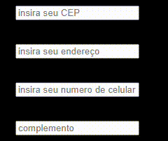
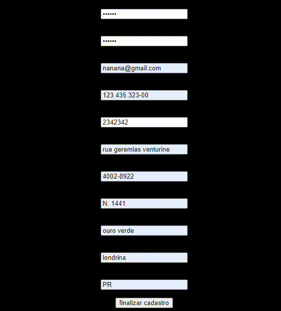

# 📂Indice

* [Intuito](#intuito) 
* [Funções](#%EF%B8%8Ffun%C3%A7%C3%B5es) 
* [Ultima data alterada](#ultima-data-alterada) 
* [Criador do site](#criador-do-site)

## 💬Intuito

esse tela foi criado no intuito de aprender a mecher com alguns codigos (foi uma das primeiras que fiz para aprender a mecher com codigo). 

## ⚙️Funções

O site tem a função de uma tela de cadastro de um site mas ele ainda não é funcional.

Ele possui caixas de texto para colocar seus dados e o botão de finalizar cadastro que como eu disse ainda não te leva alugar nenhum  

## 📅Ultima data alterada
12/09/2023

## Criador do site

* Gustavo Henrique  
 Meu [Git Hub](https://github.com/foxymplayer)

 ## imgs do app

 * gif das barras de escrita de nome, data de nascimento e senha:

 

 *  gif das barras de confirmar senha, e-mail e cpf:

 

 * gif das barras de cep, endereço, numero de tel e complementos de endereço:

 

 * gif das barras de bairro, cidade e estado :

 

 * finalização de cadastro:

 
