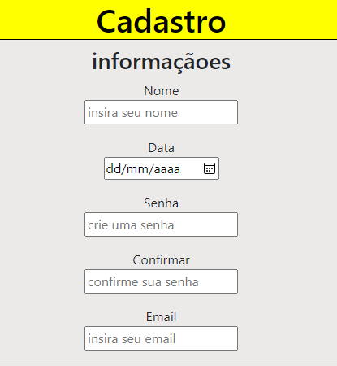
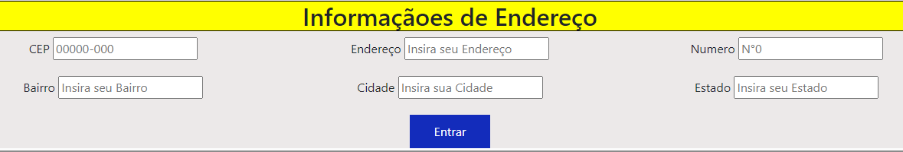

# 📂Indice

* [Intuito](#intuito) 
* [Funções](#%EF%B8%8Ffun%C3%A7%C3%B5es) 
* [Sobre a Criação](#%EF%B8%8Fsobre-a-cria%C3%A7%C3%A3o)
* [Ultima data alterada](#ultima-data-alterada) 
* [Criador do site](#criador-do-site)
* [Fontes ultiliadas](#tecnologias-ultilizadas)

## 💬Intuito

esse tela foi criado no intuito de aprender a mecher com alguns codigos (foi uma das primeiras que fiz para aprender a mecher com codigo). 

## ⚙️Funções

O site tem a função de uma tela de cadastro de um site mas ele ainda não é funcional.

Ele possui caixas de texto para colocar seus dados e o botão de finalizar cadastro que como eu disse ainda não te leva alugar nenhum, e tambem a parte que foi adicionada recentemente que é sobre informação de endereço

## 🏗️Sobre a criação:

Ultilizei [css](https://developer.mozilla.org/pt-BR/docs/Web/CSS) para estilizar o site adicionando:

- backgrounds
- border
- color
- padding
- text-decoration
- display
- font-size

## 📅Ultima data alterada
27/10/2023

## Criador do site

* Gustavo Henrique  
 Meu [Git Hub](https://github.com/foxymplayer)

 ## imgs do app

 * Imagem das barras de cadastro:

 

 * Imagem da tela de preenchimento de endereço

 

## Tecnologias ultilizadas:

 

